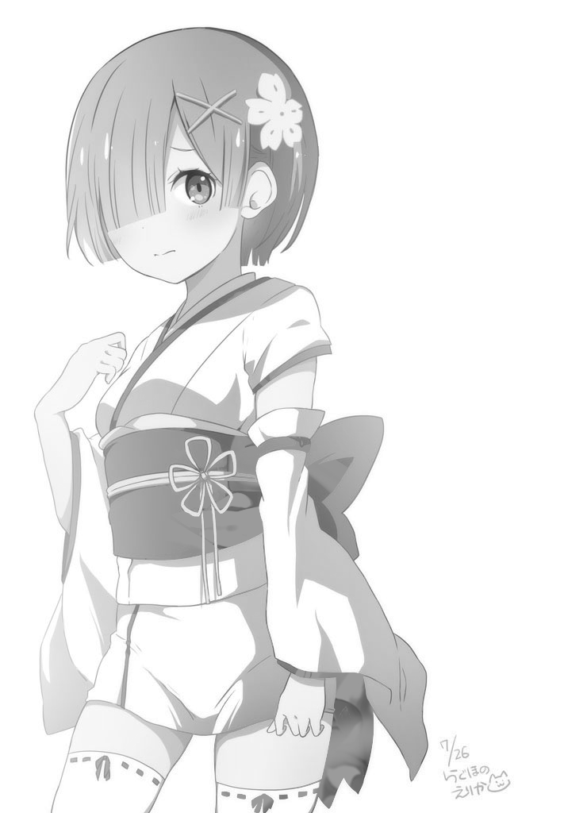

# hoshizora-py
Generate alpha blending of two images with different looks in black/white background.

### Dependency
- opencv-python
- numpy
- optparse

to install dependencies
```bash
pip3 install -r requirements.txt
```

### Usage
```bash
hoshizora.py -f front.jpg -b back.jpg -o rem.png -d 100```
```
-f front layer, any image format that supported by OpenCV
-b back layer, any image format that supported by OpenCV
-o output image, png image format gray + alpha
-i increase brightness of front layer
     negetive value is accepted in case you need to decrease the brightness for front layer
-d decrease brightness of back layer
     negetive value is accepted in case you need to increase the brightness for back layer
```

### Screenshots


